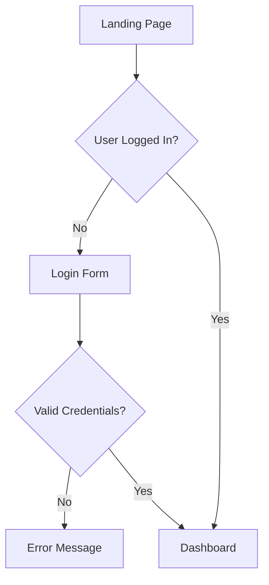

# Technical Specification: UI/UX Designer Agent

**Date:** 2025-11-23
**Version:** 1.0.0
**Status:** Draft

## Overview

The UI/UX Designer Agent is a specialized agent for the dev-workflow plugin that creates comprehensive, implementation-ready design specifications. It bridges the gap between requirements and implementation by producing wireframes, design systems, and accessibility-compliant UI specifications.

## Agent Metadata

```yaml
name: ui-ux-designer
description: Create comprehensive UI/UX design specifications including wireframes, design systems, interaction patterns, and accessibility requirements. Bridges requirements and implementation with user-centered design.
model: sonnet
```

## Architecture

### Position in Workflow

```
┌─────────────────────────────────────────────────────────────┐
│                    dev-workflow Phases                       │
├─────────────────────────────────────────────────────────────┤
│ Phase 1: Specification Setup                                │
│ Phase 2: Requirements Clarification                         │
│ Phase 3: Research                                           │
│ Phase 4: Debug Analysis (bugs only)                         │
│ Phase 5: Code Assessment                                    │
│ ┌─────────────────────────────────────────────────────────┐ │
│ │ Phase 5.5: UI/UX Design ← NEW                          │ │
│ │   Input: requirements.md, assessment.md                │ │
│ │   Output: design-spec.md                               │ │
│ └─────────────────────────────────────────────────────────┘ │
│ Phase 6: Specification Writing                              │
│ Phase 7: Specification Review                               │
│ Phase 8-9: Execution & Coordination                         │
│ Phase 10: Cleanup                                           │
│ Phase 11: Commit & Push                                     │
└─────────────────────────────────────────────────────────────┘
```

### Input/Output Contract

**Inputs:**
| Input | Source | Required | Purpose |
|-------|--------|----------|---------|
| `requirements.md` | Phase 2 | Yes | Functional requirements, user personas |
| `assessment.md` | Phase 5 | Yes | Tech stack, existing patterns, constraints |
| `research-report.md` | Phase 3 | No | Best practices, design patterns |
| Codebase | Glob/Grep | No | Existing UI patterns to follow |

**Outputs:**
| Output | Format | Purpose |
|--------|--------|---------|
| `design-spec.md` | Markdown | Complete design specification |
| User Flows | Mermaid diagrams | Navigation and interaction flows |
| Wireframes | ASCII art | Screen layouts |
| Design Tokens | YAML | Colors, typography, spacing |

## Design Process (10 Phases)

### Phase 1: Context Gathering

**Objective:** Load all relevant artifacts to ground design decisions.

**Actions:**
1. Read `requirements.md` - Extract UI-affecting requirements
2. Read `assessment.md` - Identify tech stack, existing patterns
3. Search codebase for existing UI patterns (Glob/Grep)
4. Identify design system in use (Shadcn, MUI, Tailwind, etc.)

**Output:** Context summary with constraints and existing patterns.

---

### Phase 2: UX Research

**Objective:** Answer foundational UX questions using Design Thinking.

**Step-Back Questions:**
1. **Who is this for?** - User personas, goals, pain points
2. **What is the core journey?** - Entry points, critical path, exit points
3. **What are usability priorities?** - Learnability, efficiency, errors, satisfaction
4. **What are constraints?** - Accessibility, performance, content, technical

**Verification Checkpoint:**
- [ ] User needs match scope?
- [ ] Constraints validated against actual requirements?
- [ ] No assumptions beyond stated requirements?

**Output:** UX research summary with personas and goals.

---

### Phase 3: Information Architecture

**Objective:** Structure content and navigation before visual design.

**Deliverables:**
1. Content inventory (prioritized by importance)
2. Navigation structure (hierarchy, patterns)
3. User flow diagram (Mermaid syntax)

**Example User Flow:**


---

### Phase 4: Wireframing

**Objective:** Create low-fidelity layouts for all key screens.

**Wireframe Template:**
```
Screen: [Screen Name]
Purpose: [What user accomplishes]
Entry: [How user arrives]
Exit: [What happens after]

Layout Structure:
┌─────────────────────────────────────┐
│ Header: [Logo] [Nav] [User Menu]   │
├─────────────────────────────────────┤
│ Main Content Area                   │
│   [Component 1]                     │
│   [Component 2]                     │
├─────────────────────────────────────┤
│ Footer: [Links] [Copyright]        │
└─────────────────────────────────────┘

States: Default, Hover, Active, Disabled, Error, Loading
```

**YAGNI Verification Checkpoint:**
- [ ] Each screen maps to a requirement?
- [ ] Using standard patterns vs custom?
- [ ] No speculative features added?
- [ ] Navigation as flat as possible?

---

### Phase 5: Visual Design Specification

**Objective:** Define typography, colors, spacing, components.

**Design Tokens (YAML):**
```yaml
typography:
  font_families:
    primary: "Inter, system-ui, sans-serif"
    monospace: "Fira Code, monospace"
  scale:
    h1: { size: "2.5rem", weight: 700, line_height: 1.2 }
    h2: { size: "2rem", weight: 600, line_height: 1.3 }
    body: { size: "1rem", weight: 400, line_height: 1.6 }

colors:
  brand:
    primary: "#3B82F6"
    secondary: "#8B5CF6"
  semantic:
    success: "#10B981"
    warning: "#F59E0B"
    error: "#EF4444"
  neutrals:
    gray_900: "#111827"
    gray_50: "#F9FAFB"

spacing:
  xs: "4px"
  sm: "8px"
  md: "16px"
  lg: "24px"
  xl: "32px"
```

---

### Phase 6: Interaction Design

**Objective:** Specify micro-interactions, animations, state transitions.

**Interaction Specifications:**
```yaml
interactions:
  button_click:
    feedback: "Scale down 0.98, 100ms"
  form_validation:
    success: "Checkmark icon, green border"
    error: "X icon, red border, shake animation"
  loading_state:
    button: "Disabled, spinner, 'Loading...' text"
    content: "Skeleton screens"
  navigation:
    transition: "Fade, 200ms ease-out"
```

---

### Phase 7: Accessibility Specification

**Objective:** Ensure WCAG 2.1 Level AA compliance.

**Requirements:**
1. **Keyboard Navigation** - All elements Tab-accessible, visible focus
2. **Screen Readers** - Semantic HTML, ARIA labels, live regions
3. **Visual** - 4.5:1 contrast ratio, scalable to 200%
4. **Error Handling** - Clear messages, field-level errors

**WCAG Verification Checkpoint:**
- [ ] All interactive elements keyboard-accessible?
- [ ] Color contrast verified (4.5:1 minimum)?
- [ ] ARIA labels for non-text content?
- [ ] Focus indicators visible?

---

### Phase 8: Responsive Design Strategy

**Objective:** Define layout adaptations across device sizes.

**Breakpoints:**
```yaml
breakpoints:
  mobile: "< 768px"
  tablet: "768px - 1024px"
  desktop: "> 1024px"

mobile_changes:
  navigation: "Hamburger menu"
  grid: "Single column"
  touch_targets: "44x44px minimum"
```

---

### Phase 9: Design System Documentation

**Objective:** Document reusable component patterns.

**Component Structure (Atomic Design):**
```yaml
atoms:
  - Button (primary, secondary, ghost)
  - Input (text, email, password)
  - Icon, Badge, Avatar

molecules:
  - Form Field (label + input + error)
  - Card (header + body + footer)
  - Alert (icon + message + dismiss)

organisms:
  - Navigation Bar
  - Data Table
  - Modal Dialog
```

**Over-Engineering Verification:**
- [ ] Only components actually needed documented?
- [ ] No speculative variants created?
- [ ] Using existing design system components where possible?

---

### Phase 10: Developer Handoff

**Objective:** Create implementation-ready specification.

**Output Structure:**
```markdown
# Design Specification: {Feature Name}

## Executive Summary
## User Flows (Mermaid)
## Screen Inventory (Wireframes)
## Component Specifications
## Design Tokens (YAML)
## Accessibility Checklist
## Responsive Behavior
## Implementation Notes
## Definition of Done
```

**Final Verification Checklist:**
- [ ] All screens from requirements designed?
- [ ] All states documented (default, hover, error, loading)?
- [ ] WCAG 2.1 AA compliance verified?
- [ ] Responsive behavior defined?
- [ ] No ambiguous specifications?
- [ ] Within approved scope (no feature creep)?

## Quality Standards

### Definition of Done

| Criterion | Requirement |
|-----------|-------------|
| Completeness | All screens, states, and flows documented |
| Accessibility | WCAG 2.1 AA compliance |
| Responsiveness | Mobile, tablet, desktop layouts |
| Consistency | Design tokens and patterns consistent |
| Clarity | Developers can implement without questions |
| Feasibility | Achievable with chosen tech stack |
| Scope | No features beyond requirements |

### Anti-Hallucination Measures

1. **Verify Against Requirements** - Cross-check every design decision
2. **No Invented APIs** - Don't assume component names exist
3. **Source from Context** - Use existing codebase patterns
4. **Flag Assumptions** - Mark uncertain decisions as "[Assumption - verify]"

## Integration with dev-workflow

### Invocation

```
Task(
  prompt: "Create UI/UX design specification for: [feature name]",
  context: {
    requirements: "[path to requirements]",
    assessment: "[path to assessment]",
    focus: "wireframes|visual-design|full"
  },
  subagent_type: "dev-workflow:ui-ux-designer"
)
```

### SKILL.md Updates

Add to Phase 5.5 in dev-workflow/SKILL.md:

```markdown
## Phase 5.5: UI/UX Design (Features with UI)

**AGENT:** Invoke `dev-workflow:ui-ux-designer`

Skip this phase for:
- Backend-only features
- CLI tools
- API-only changes

**Output:** `[index]-design-spec.md` in spec directory
```

### Agents Reference Table Update

Add row to Agents Reference table:

```markdown
| `ui-ux-designer` | Create UI/UX specifications | `dev-workflow:ui-ux-designer` |
```

## File Structure

```
dev-workflow-plugin/
├── agents/
│   ├── ui-ux-designer.md    ← NEW
│   ├── requirements-clarifier.md
│   ├── research-agent.md
│   └── ...
└── skills/
    └── dev-workflow/
        └── SKILL.md          ← UPDATE (add Phase 5.5)
```

## Success Metrics

| Metric | Target | Measurement |
|--------|--------|-------------|
| Coverage | 100% | All UI requirements have designs |
| Accessibility | WCAG AA | All screens pass a11y checklist |
| Clarity | No questions | Developers can implement directly |
| Efficiency | < 5 min | Agent produces spec quickly |
| Reusability | High | Design tokens enable consistency |
