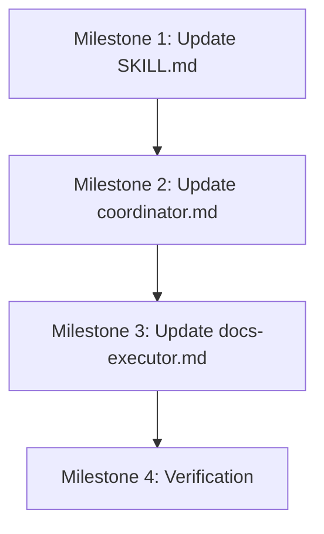

# Implementation Plan: Super Dev Documentation Agent Restructure

**Specification:** [link to technical specification]
**Estimated Phases:** 4

**CRITICAL:** All phases/milestones defined in this plan MUST be implemented in a single continuous execution. The execution-coordinator will NOT pause between phases or ask for permission to continue. Every phase from Phase 1 to Final Phase will be completed automatically.

## Milestones

### Milestone 1 (Phase 1): Update Workflow Documentation
**Goal:** Update the super-dev SKILL.md to reflect the new workflow with docs-executor moved to Phase 10
**Dependencies:** None

#### Deliverables
- [ ] Update workflow phases diagram
- [ ] Modify Phase 8 description (remove docs-executor)
- [ ] Add Phase 10 description (documentation)
- [ ] Update agent references
- [ ] Verify all phase numbers are consistent

#### Acceptance Criteria
- Workflow diagram shows docs-executor in Phase 10
- Phase 8 only mentions dev-executor and qa-agent
- Phase 10 clearly describes documentation responsibilities
- Phase numbering is sequential (0-12)

#### Files Affected
- `super-dev-plugin/skills/super-dev/SKILL.md`

### Milestone 2 (Phase 2): Update Coordinator Agent
**Goal:** Modify the coordinator agent to orchestrate the new phase structure
**Dependencies:** Milestone 1 complete

#### Deliverables
- [ ] Update phase flow definition
- [ ] Modify Phase 8 parallel execution (2 agents)
- [ ] Add Phase 10 sequential execution
- [ ] Update iteration logic for Phase 8/9 loop
- [ ] Adjust quality gates for new phase structure

#### Acceptance Criteria
- Phase 8 only invokes dev-executor and qa-agent
- Phase 10 invokes docs-executor after code review complete
- Iteration loop properly cycles between Phase 8 and 9
- Phase transition checkpoints updated

#### Files Affected
- `super-dev-plugin/agents/coordinator.md`

### Milestone 3 (Phase 3): Update docs-executor Agent
**Goal:** Modify docs-executor to work in sequential mode rather than parallel
**Dependencies:** Milestone 2 complete

#### Deliverables
- [ ] Remove parallel execution references
- [ ] Update for Phase 10 sequential execution
- [ ] Modify trigger conditions
- [ ] Update input expectations (final code state)
- [ ] Adjust documentation update patterns
- [ ] Remove real-time update requirements

#### Acceptance Criteria
- Agent description reflects sequential execution
- No references to parallel coordination
- Clear trigger: Phase 10 entry after review
- Inputs include final code state and review results
- Documentation happens in single pass

#### Files Affected
- `super-dev-plugin/agents/docs-executor.md`

### Milestone 4 (Phase 4): Final Verification
**Goal:** Verify all changes are consistent and complete
**Dependencies:** Milestones 1-3 complete

#### Deliverables
- [ ] Cross-reference all phase numbers
- [ ] Verify agent orchestration consistency
- [ ] Check workflow diagrams match text
- [ ] Validate phase transition logic
- [ ] Create summary of changes

#### Acceptance Criteria
- All documents consistently reference new phase structure
- No orphaned references to old Phase 8 docs execution
- Phase 8/9/10 sequence is logical
- No gaps in workflow coverage

#### Files Affected
- All modified files from previous milestones

## Risk Assessment

| Risk | Likelihood | Impact | Mitigation |
|------|------------|--------|------------|
| Phase numbering confusion | Medium | High | Double-check all phase references across files |
| docs-executor still references parallel execution | Low | Medium | Search for "parallel" in docs-executor.md |
| Coordinator phase flow broken | Low | High | Test phase transition logic in description |
| Workflow diagram inconsistency | Medium | Medium | Compare diagram with text descriptions |

## Dependencies

### External Dependencies
- None (all changes are internal to super-dev plugin)

### Internal Dependencies
- SKILL.md updates must precede coordinator changes
- Coordinator changes must precede docs-executor updates
- All changes must be consistent with each other

## Success Metrics
- [ ] Workflow documentation accurately reflects new structure
- [ ] Coordinator orchestration supports new phase flow
- [ ] docs-executor agent configured for sequential execution
- [ ] No inconsistencies between agent descriptions
- [ ] Phase 8/9 iteration loop remains functional
- [ ] New Phase 10 clearly defined and positioned

## Implementation Sequence

## Detailed Change Summary

### Phase 8 Changes
- Before: dev-executor + qa-agent + docs-executor (parallel)
- After: dev-executor + qa-agent (parallel)
- Impact: Simplified coordination, no documentation conflicts

### Phase 9 Changes
- No direct changes, but iteration loop affects documentation
- Must ensure docs-executor not invoked during iterations

### Phase 10 Changes (NEW)
- Before: Phase 10 was "Cleanup"
- After: Phase 10 is "Documentation", Phase 11 becomes "Cleanup"
- All subsequent phases shift by +1

### Agent Changes
- docs-executor: From parallel real-time to sequential batch
- coordinator: Updated phase orchestration logic
- No changes to other agents

## Testing Approach

### Document Consistency Tests
1. Search all references to Phase 8 in plugin files
2. Verify none mention docs-executor
3. Search all references to Phase 10
4. Verify docs-executor properly referenced

### Workflow Logic Tests
1. Trace phase transitions 0-12
2. Verify 8→9→10 sequence makes sense
3. Check iteration loop still functional
4. Ensure no phase gaps or overlaps

### Agent Role Tests
1. Verify each agent has clear phase assignment
2. Check no agent assigned to multiple phases
3. Validate agent responsibilities match phase goals

## Rollback Strategy

If issues arise during implementation:
1. Keep backup of original files
2. Document exact changes made
3. Revert files in reverse order of changes
4. Test original workflow functionality

## Post-Implementation Tasks
- Update any external documentation referencing old workflow
- Communicate changes to plugin users
- Monitor initial executions for issues
- Collect feedback for further improvements